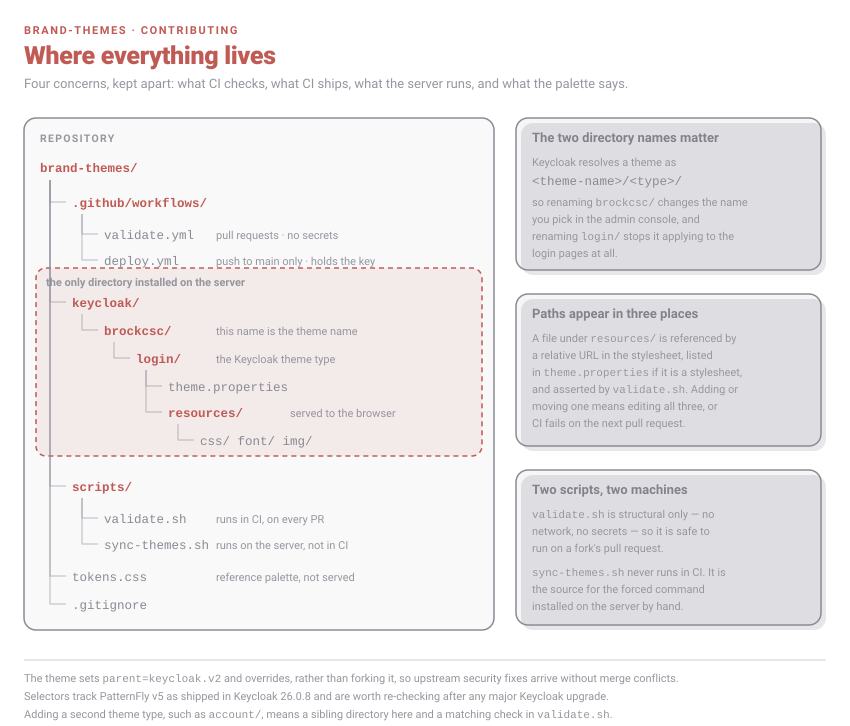

# Contributing

This is a design repo with a deploy key attached to it, so the two things worth getting right are how the theme is
structured and what is safe to run on a pull request.

## Layout



Only `keycloak/brockcsc` is installed onto the server. Everything else is tooling or reference.

## The theme directory

Keycloak resolves a theme as `<theme-name>/<type>/`, so the two directory names are load-bearing:

- `brockcsc/` is the name you pick in the admin console. Renaming it renames the theme.
- `login/` is the theme type. Renaming it stops the theme applying to the login pages at all.

`theme.properties` is short but every line matters:

```properties
parent=keycloak.v2
import=common/keycloak
styles=css/styles.css css/brockcsc.css
```

`styles` **replaces** the parent's list rather than appending to it, which is why the parent's `css/styles.css` has
to be repeated. Dropping it ships an unstyled login page. `validate.sh` fails the build if either the `parent` line
or `css/styles.css` goes missing, because both mistakes look fine in a diff.

## Editing the CSS

`resources/css/brockcsc.css` overrides `keycloak.v2`, which is PatternFly v5. Two habits keep it maintainable:

- Declare intent through the custom properties at the top rather than repeating hex values further down.
- Where PatternFly exposes its own variable, set that too. Setting `border-radius` on a form control is not enough
  on its own; `--pf-v5-c-form-control--BorderRadius` and the border-bottom colour also have to be reset, or the
  parent's underline shows through the new border.

Selectors are versioned markup, not an API. They track Keycloak 26.0.8 and are worth re-checking after any major
Keycloak upgrade.

A file under `resources/` shows up in three places: a relative URL in the stylesheet, the `styles` list in
`theme.properties` if it is a stylesheet, and the required-files list in `validate.sh`. Adding or moving one means
editing all three.

## The two scripts run on different machines

`scripts/validate.sh` runs in CI, on every pull request including forks. It is structural only — no network, no
secrets — and it must stay that way. `validate.yml` deliberately has no access to credentials, and must never be
switched to `pull_request_target`.

`scripts/sync-themes.sh` never runs in CI. It is the source for the forced command installed on the VPS, and it is
installed there by hand. Editing it in a pull request changes nothing on the server until someone copies it across.

## Deploy safety

`deploy.yml` triggers on push to `main` only. **Do not add a `pull_request` or `pull_request_target` trigger** — that
is what stops a pull request from a fork reaching the deploy key.

The key on the server is pinned to a forced command, so `SSH_ORIGINAL_COMMAND` is discarded and the credential can
install a theme and nothing else. On the receiving end the archive is unpacked into a temporary directory, checked
for traversal-looking paths and for the theme actually being present, and only then copied beside the live theme and
swapped into place in a single `mv`. Keep that order if you touch the script: copy first, swap last, so a
half-written theme is never the live one.

Note that the tarball carries `tokens.css` but the install step only copies `keycloak/brockcsc`, so the palette file
is extracted and then discarded.

## Testing a change

There is no way to check this properly except against a real Keycloak. Run one locally, mount the theme, and set it
on a test realm:

```sh
docker run --rm -p 8080:8080 \
  -e KC_BOOTSTRAP_ADMIN_USERNAME=admin -e KC_BOOTSTRAP_ADMIN_PASSWORD=admin \
  -v "$PWD/keycloak/brockcsc:/opt/keycloak/themes/brockcsc" \
  quay.io/keycloak/keycloak:26.0.8 start-dev
```

Dev mode doesn't cache themes, so a reload picks up a CSS edit. Check the states a screenshot of the happy path
misses: a wrong password, a field in focus, a long realm name, and a narrow viewport.

Run `./scripts/validate.sh` before pushing — it is the same script CI runs.

## Docs

The diagrams in `docs/img/` are hand-written SVG, committed as files and referenced with `` — GitHub strips
inline `<svg>` out of Markdown, so they cannot be embedded directly. They are served under a strict CSP with no
scripts, no external images and no web fonts, which is why the login mock is drawn with a system font stack rather
than the Geist the real theme uses.

The chrome and annotations use one flat palette that stays legible on both GitHub themes rather than shipping a pair
per theme, because an SVG's `prefers-color-scheme` follows the operating system and not GitHub's own theme setting.
Inside the mock the theme's real colours are used as-is, since that part is a picture of a light UI.

Animation is CSS `@keyframes`, never SMIL, so it can be turned off — every animated file carries a
`prefers-reduced-motion: reduce` rule and is drawn to read correctly when completely still.

`docs/img/login-mock.svg` inlines the real `logo.svg` from the theme rather than approximating it. If the badge
changes, regenerate the mock instead of redrawing it, and keep the header block at the 76px the stylesheet sets.
When you change a colour, a radius or the deploy script, update the matching diagram in the same pull request.
