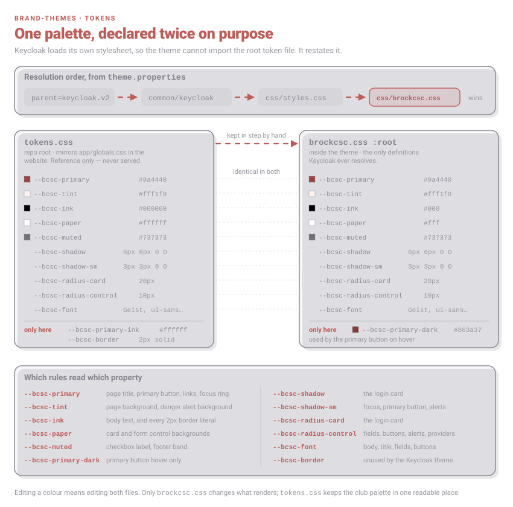
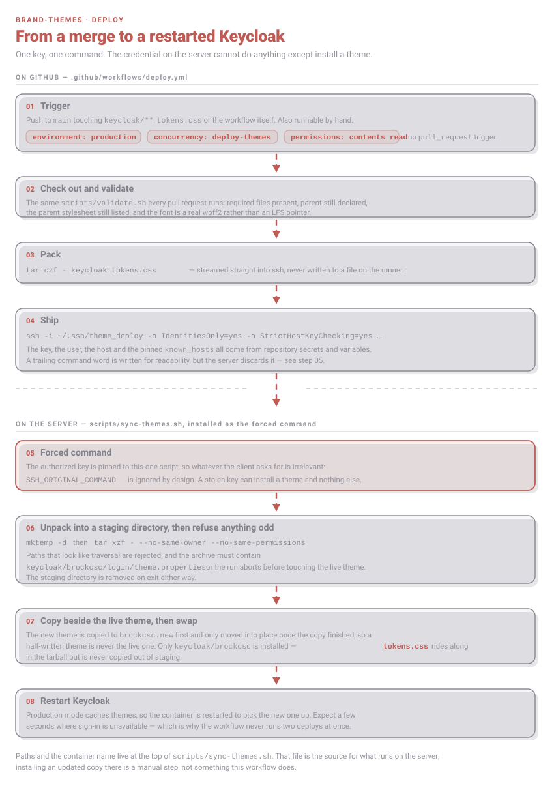

# brand-themes

BrockCSC visual identity applied to the third-party UIs execs sign in to, so Keycloak reads as an extension of
brockcsc.ca rather than a stock install.

| Theme | Applies to | Installs at |
| --- | --- | --- |
| `keycloak/brockcsc` | the `brockcsc` realm login pages | the Keycloak themes directory on the VPS |

It is an **extension, not a fork**: the theme sets `parent=keycloak.v2` and overrides on top, so upstream security
updates apply without merge conflicts.

## Tokens

`tokens.css` is the source of truth for the palette, mirroring `app/globals.css` in BrockCSC/website. Keycloak never
loads it — the theme's own stylesheet restates the same custom properties, because Keycloak resolves its stylesheet
list from `theme.properties` and there is nowhere to import a file from outside the theme.

Changing a colour means changing both files. Only `brockcsc.css` affects what renders; `tokens.css` keeps the club
palette in one readable place next to the website's.

| | |
| --- | --- |
| Primary | `#9a4440` |
| Primary, hover | `#863a37` — theme only |
| Tint | `#fff1f0` |
| Card | 2px black border, `6px 6px 0 0` shadow, 20px radius |
| Control | 10px radius, `3px 3px 0 0` shadow on focus |
| Type | Geist (bundled woff2, latin subset) |

## Deploying

Merging to `main` runs `.github/workflows/deploy.yml`, which validates the theme, tars it, and pipes it over SSH to a
key that is pinned to a forced command on the VPS and can do nothing else.

Keycloak caches themes in production mode, so the container is restarted on install — expect a few seconds where
sign-in is unavailable. That is also why the workflow refuses to run two deploys at once.

After the first deploy, set the realm's login theme:
**Keycloak admin → realm `brockcsc` → Realm settings → Themes → Login theme → `brockcsc`**.

The host, user and `known_hosts` entry come from repository variables, and the key from a repository secret. The
paths and container name the server-side script uses live at the top of `scripts/sync-themes.sh`; installing an
updated copy of that script on the VPS is a manual step, not something the workflow does.

## Contributing

`scripts/validate.sh` runs on every pull request. It checks structure only — no network, no secrets — because pull
requests from forks must never have access to credentials. `deploy.yml` runs on push to `main` only, so a
contributor PR cannot reach the deploy key.

Verify rendering against a real Keycloak; the selectors track PatternFly v5 as shipped in Keycloak 26.0.8 and should
be re-checked after a major upgrade.

See [CONTRIBUTING.md](CONTRIBUTING.md).
