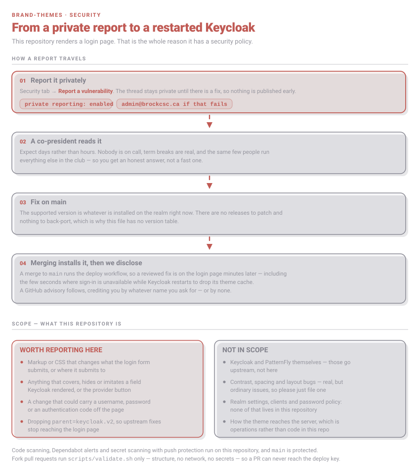

# Security policy

A theme is only CSS, markup and a font — but this one renders the page people type their Keycloak
password into. Anything that changes what that form does, or what it looks like it does, matters
more than it would anywhere else in the club's code.

## Reporting

Use **[Report a vulnerability](https://github.com/BrockCSC/brand-themes/security/advisories/new)**
on the Security tab. Private reporting is enabled, so the thread stays between us until there is a
fix. If GitHub isn't an option, email **admin@brockcsc.ca** — it reaches the co-presidents and the
repo owner.

A screenshot of the rendered login page, with the selector or rule behind it, tells us most of what
we need.

## What happens next

We're students, volunteering. There's no rota, no pager and no SLA. Someone will read your report
and answer you — days rather than hours, and slower over exams and the summer. There is **no bug
bounty**; we can offer credit in the advisory, under whatever name you like.

Fixes here are quick to ship: merging to `main` installs the theme and restarts Keycloak, so a
reviewed fix is live within minutes.

## Supported versions

Whatever is installed on the realm right now. There are no releases, no tags and nothing to
back-port, so there is no version table here.

## In scope

- **The login form** — markup or CSS that changes what it submits, or where it submits to.
- **Spoofing** — anything that covers, hides or imitates a field Keycloak rendered, the
  identity-provider button, or an error message, so the page says something other than the truth.
- **Leaking credentials** — any way a username, password or authentication code could be carried
  off the page. The theme ships its own font and logo precisely so the login page never fetches
  anything from a third party; a change that reintroduces one is a bug.
- **The parent chain** — dropping `parent=keycloak.v2` or the parent stylesheet, which is what
  keeps upstream Keycloak fixes applying to our login page. `scripts/validate.sh` checks for this,
  so a way past that check counts too.

## Not in scope

- Keycloak and PatternFly themselves. Those go upstream; the selectors here track PatternFly v5 as
  shipped in Keycloak 26.0.8, so tell us if an upgrade breaks them, as an ordinary issue.
- Contrast, spacing and layout bugs. Real, and worth reporting — just open an issue.
- Realm settings, clients and password policy. None of that lives in this repository.
- How the theme reaches the server, which is operations rather than code here.

## Already automated

CodeQL code scanning, Dependabot alerts, and secret scanning with push protection run on this
repository, and `main` is protected. Pull requests from forks run `scripts/validate.sh` only — no
network, no secrets — so a contributor PR can never reach the deploy key.
